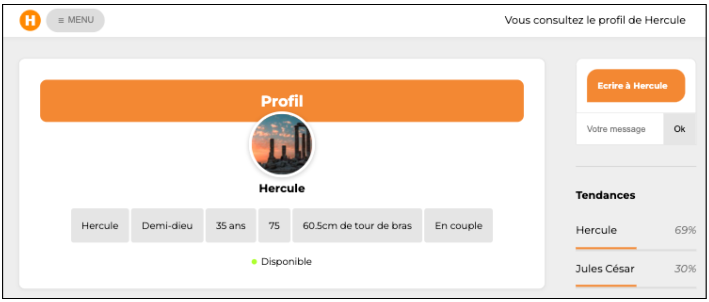

# Social Idea

**Social Idea** est un réseau social permettant d'afficher ses informations personnelles (nom, travail, âge, département, statut, ...), son statut de disponibilité, sa liste d'amis et ses activités.

## Données dynamiques

Chaque utilisateur aura sa page de profil avec ses informations associées.

## Technologies utilisées

- HTML, **CSS** et **JavaScript**

## Contributeur

- Alexandre Klein a développé ce projet